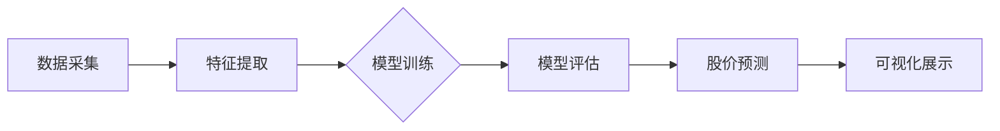

# 📈 BigA - 大A股票智能预测系统

**基于多种机器学习模型的股票预测平台 | 历史数据分析 + 特征工程 + 智能预测**

## 项目概述
BigA是一个跨平台的股票数据分析与预测系统，通过Rust和Svelte构建，主要功能包括：
- 📊 **沪深股市数据采集与管理**
- 🧠 **多模型股票预测**（线性回归、决策树、SVM、朴素贝叶斯）
- 📱 **跨平台客户端支持**（Windows、macOS、Linux）
- 🔄 **实时数据更新与模型持续训练**

## 技术栈

### 前端
- Svelte + TypeScript：构建响应式用户界面
- TailwindCSS：现代化界面样式

### 后端
- Rust：高性能、安全的后端逻辑实现
- SQLite + SQLx：轻量级数据存储与管理
- Tauri：跨平台桌面应用框架

### 机器学习
- Linfa：Rust实现的机器学习库
- 支持多种模型：线性回归、决策树、SVM、朴素贝叶斯
- 特征工程：MA、RSI、MACD等技术指标

## 开发环境配置

### 前置要求
- Node.js（推荐最新LTS版本）
- Rust工具链（最新稳定版）
- pnpm包管理器

### 初始化步骤
```bash
# 克隆仓库
git clone https://github.com/zzhtl/biga.git
cd biga

# 安装依赖
pnpm install

# 运行开发环境
cargo tauri dev
```

## 🚀 项目功能
- ✅ **股票基础数据管理**：沪深两市股票信息查询与管理
- ✅ **历史数据分析**：K线、交易量等数据可视化
- ✅ **多模型预测**：支持多种机器学习算法预测股价趋势
- ✅ **模型评估**：准确率、均方误差等指标评估模型性能
- 🚧 **批量预测**：自动筛选潜力股票（开发中）
- 🔜 **预警系统**：异动检测和风险提示（规划中）

## 使用指南

### 股票预测
1. 输入股票代码（如：sh000001）
2. 选择使用现有模型或训练新模型
3. 设置预测参数（预测天数、特征选择等）
4. 查看预测结果

### 模型训练
1. 输入股票代码
2. 选择模型类型（线性回归、决策树等）
3. 配置训练参数（特征选择、历史窗口等）
4. 训练完成后即可用于预测

## 数据流图


## 贡献指南
欢迎提交Issues和Pull Requests！请确保您的代码符合项目的代码风格和测试要求。

## 许可证
MIT 