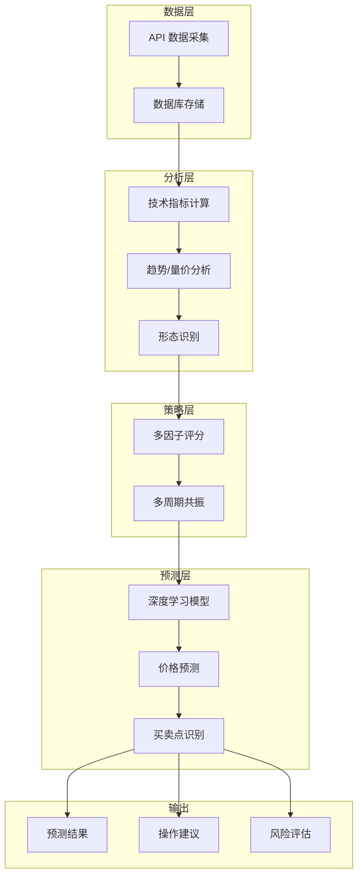

# 📈 BigA - 大A股票智能预测系统

**基于深度学习的股票预测平台 | 模块化架构 + 技术指标 + 多因子策略**

## 项目概述

BigA 是一个跨平台的股票数据分析与预测系统，采用 Rust + Svelte 构建，具有清晰的模块化架构：

- 📊 **沪深股市数据采集与管理**
- 🧠 **深度学习股票预测**（Candle 框架）
- 💎 **金融级预测策略**（多因子评分、买卖点识别）
- 📈 **技术指标分析**（MACD、KDJ、RSI、布林带等）
- 📱 **跨平台支持**（Windows、macOS、Linux）

## 🏗️ 项目架构

```
src-tauri/src/
├── lib.rs                 # 应用入口
├── error.rs               # 统一错误处理
│
├── config/                # 📋 配置模块
│   ├── constants.rs       # 常量定义
│   └── weights.rs         # 策略权重配置
│
├── utils/                 # 🔧 工具模块
│   ├── date.rs            # 日期处理
│   └── math.rs            # 数学计算
│
├── db/                    # 💾 数据层
│   ├── connection.rs      # 数据库连接池
│   ├── models.rs          # 数据模型
│   └── repository.rs      # 数据仓库（CRUD）
│
├── api/                   # 🌐 外部 API
│   └── stock.rs           # 股票数据接口
│
├── prediction/            # 🎯 预测核心模块
│   ├── types.rs           # 类型定义
│   │
│   ├── indicators/        # 📊 技术指标
│   │   ├── macd.rs        # MACD 指标
│   │   ├── kdj.rs         # KDJ 指标
│   │   ├── rsi.rs         # RSI 指标
│   │   ├── bollinger.rs   # 布林带
│   │   ├── obv.rs         # OBV 能量潮
│   │   ├── cci.rs         # CCI 指标
│   │   ├── dmi.rs         # DMI 趋向指标
│   │   └── atr.rs         # ATR 波动率
│   │
│   ├── analysis/          # 📈 分析模块
│   │   ├── trend.rs       # 趋势分析
│   │   ├── volume.rs      # 量价分析
│   │   ├── pattern.rs     # K线形态识别
│   │   └── support_resistance.rs  # 支撑阻力位
│   │
│   ├── strategy/          # 💡 策略模块
│   │   ├── multi_factor.rs      # 多因子评分
│   │   └── multi_timeframe.rs   # 多周期共振
│   │
│   └── model/             # 🤖 机器学习
│       ├── training.rs    # 模型训练
│       ├── inference.rs   # 预测推理
│       └── management.rs  # 模型管理
│
├── services/              # ⚙️ 服务层
│   ├── stock.rs           # 股票服务
│   ├── historical.rs      # 历史数据服务
│   └── prediction.rs      # 预测服务
│
└── commands/              # 🎮 Tauri 命令
    ├── stock.rs           # 股票命令
    ├── stock_list.rs      # 股票列表
    ├── stock_realtime.rs  # 实时数据
    ├── stock_historical.rs # 历史数据
    └── stock_prediction.rs # 预测命令
```

## 技术栈

### 前端
- **Svelte + TypeScript**：响应式用户界面
- **TailwindCSS**：现代化样式框架

### 后端
- **Rust**：高性能后端逻辑
- **Tauri**：跨平台桌面应用框架
- **SQLite + SQLx**：异步数据库操作

### 机器学习
- **Candle**：Rust 原生深度学习框架
- **4层深度神经网络**：256→128→64→32 + 残差连接
- **训练优化**：AdamW、学习率调度、早停、L2 正则化、Dropout

## 🚀 核心功能

### 📊 技术指标（8大指标）
| 指标 | 说明 | 用途 |
|------|------|------|
| MACD | 指数平滑异同移动平均线 | 趋势判断、金叉死叉 |
| KDJ | 随机指标 | 超买超卖、短期转折 |
| RSI | 相对强弱指数 | 超买超卖判断 |
| 布林带 | Bollinger Bands | 波动区间、突破信号 |
| OBV | 能量潮指标 | 量价配合分析 |
| CCI | 商品通道指数 | 异常波动检测 |
| DMI | 趋向指标 | 趋势强度判断 |
| ATR | 真实波动幅度 | 波动率、止损设置 |

### 💎 金融级分析
- ✅ **趋势分析**：MA 多周期趋势、趋势强度量化
- ✅ **量价分析**：量价配合、OBV 趋势、吸筹信号
- ✅ **K线形态**：10+ 经典形态识别（锤子线、早晨之星等）
- ✅ **支撑阻力**：5类关键价位（MA/高低点/整数关口/密集区/斐波那契）
- ✅ **多因子评分**：7大维度综合评分
- ✅ **多周期共振**：日/周/月三重确认

### 🤖 深度学习预测
- ✅ **模型训练**：自定义训练参数、批量训练
- ✅ **智能预测**：价格预测 + 方向预测 + 置信度
- ✅ **预测理由**：每个预测带详细理由和关键因素
- ✅ **模型管理**：保存、加载、删除、评估

## 开发环境配置

### 前置要求
- Node.js（推荐 LTS 版本）
- Rust 工具链（最新稳定版）
- pnpm 包管理器

### 初始化步骤
```bash
# 克隆仓库
git clone https://github.com/zzhtl/biga.git
cd biga

# 安装依赖
pnpm install

# 运行开发环境
cargo tauri dev
```

### 运行示例
```bash
cd src-tauri

# 测试历史数据获取
cargo run --example test_historical_data

# 测试增强预测
cargo run --example test_enhanced_prediction

# 测试专业预测策略
cargo run --example test_professional_prediction

# 测试技术指标
cargo run --example test_indicators

# 测试 MACD 计算
cargo run --example test_macd_full
```

## 快速开始

### 1. 基础预测
```
1. 输入股票代码（如：sh600519）
2. 选择现有模型或训练新模型
3. 设置预测天数
4. 点击"快速预测"查看结果
```

### 2. 金融级预测
```
1. 输入股票代码
2. 选择已有模型
3. 点击"💎 金融级预测"
4. 查看买卖点信号、支撑压力位等专业分析
```

### 3. 模型训练
```
1. 输入股票代码
2. 配置训练参数（epochs、batch_size、learning_rate）
3. 训练完成后即可用于预测
```

## 数据流图



## 📚 文档导航

| 文档 | 说明 |
|------|------|
| 📘 **[综合使用指南](./COMPREHENSIVE_GUIDE.md)** | 完整功能说明、技术指标详解 |
| 🤖 **[模型优化详解](./MODEL_OPTIMIZATION_V3.md)** | 神经网络架构、训练策略 |
| 🔧 **[预测修复详解](./PREDICTION_FIX_V3.1.md)** | 预测逻辑、均值回归机制 |

## ⚠️ 免责声明

本系统仅供技术学习和研究使用，不构成任何投资建议。股市有风险，投资需谨慎。使用本系统进行投资决策所产生的任何损失，开发者不承担任何责任。

## 贡献指南

欢迎提交 Issues 和 Pull Requests！请确保代码符合项目的代码风格和测试要求。

## 许可证

MIT
