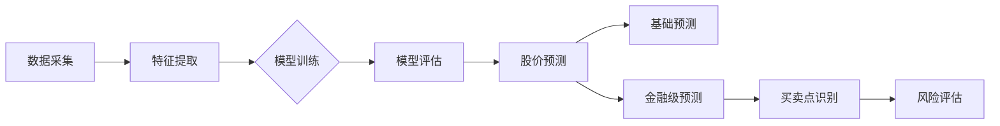

# 📈 BigA - 大A股票智能预测系统

**基于多种机器学习模型的股票预测平台 | 历史数据分析 + 特征工程 + 智能预测**

## 项目概述
BigA是一个跨平台的股票数据分析与预测系统，通过Rust和Svelte构建，主要功能包括：
- 📊 **沪深股市数据采集与管理**
- 🧠 **多模型股票预测**（线性回归、决策树、SVM、深度学习）
- 💎 **金融级预测策略**（买卖点识别、风险评估）
- 📱 **跨平台客户端支持**（Windows、macOS、Linux）
- 🔄 **实时数据更新与模型持续训练**

## 📚 功能文档导航

| 功能模块 | 文档 | 说明 |
|---------|------|------|
| 💎 **金融级预测** | [PROFESSIONAL_PREDICTION_GUIDE.md](./PROFESSIONAL_PREDICTION_GUIDE.md) | 买卖点识别、支撑压力位、多周期共振分析 |
| 🇨🇳 **A股高级策略** | [CHINA_STOCK_ADVANCED_STRATEGY.md](./CHINA_STOCK_ADVANCED_STRATEGY.md) | 筹码分布、缠论、资金流向、主力行为分析 |
| 📊 **股票预测** | [README_STOCK_PREDICTION.md](./README_STOCK_PREDICTION.md) | 基础预测功能、模型训练、特征工程 |
| 🔄 **回测分析** | [README_BACKTEST.md](./README_BACKTEST.md) | 模型性能评估、历史数据回测 |
| 🔍 **多周期分析** | [README_MULTI_TIMEFRAME_ANALYSIS.md](./README_MULTI_TIMEFRAME_ANALYSIS.md) | 日/周/月线技术分析、MACD/KDJ信号 |
| ⚙️ **模型优化** | [README_OPTIMIZATION.md](./README_OPTIMIZATION.md) | 特征优化、超参数调优 |
| 📈 **准确率统计** | [TODO_ACCURACY_TRACKING.md](./TODO_ACCURACY_TRACKING.md) | 信号准确率跟踪、历史表现分析（规划中）|

## 技术栈

### 前端
- Svelte + TypeScript：构建响应式用户界面
- TailwindCSS：现代化界面样式

### 后端
- Rust：高性能、安全的后端逻辑实现
- SQLite + SQLx：轻量级数据存储与管理
- Tauri：跨平台桌面应用框架

### 机器学习
- Candle：Rust深度学习框架（MLP、LSTM、GRU、Transformer）
- Linfa：传统机器学习库（线性回归、决策树、SVM）
- 特征工程：MA、RSI、MACD、KDJ等20+技术指标

## 开发环境配置

### 前置要求
- Node.js（推荐最新LTS版本）
- Rust工具链（最新稳定版）
- pnpm包管理器

### 初始化步骤
```bash
# 克隆仓库
git clone https://github.com/zzhtl/biga.git
cd biga

# 安装依赖
pnpm install

# 运行开发环境
cargo tauri dev
```

## 🚀 核心功能

### 💎 金融级预测策略
- ✅ **买卖点识别**：3种买入模式 + 3种卖出模式
- ✅ **支撑压力位**：MA均线 + 斐波那契回撤
- ✅ **多周期共振**：日/周/月三重确认
- ✅ **量价背离**：底背离/顶背离预警
- ✅ **风险评估**：动态风险收益比评估

### 📊 基础预测功能
- ✅ **股票基础数据管理**：沪深两市股票信息查询与管理
- ✅ **历史数据分析**：K线、交易量等数据可视化
- ✅ **多模型预测**：支持多种机器学习算法预测股价趋势
- ✅ **模型评估**：准确率、均方误差等指标评估模型性能

### 🔄 高级功能
- ✅ **回测分析**：历史数据模型性能评估
- ✅ **特征优化**：自动化特征重要性分析
- ✅ **超参数调优**：智能参数优化建议
- 🚧 **批量预测**：自动筛选潜力股票（开发中）
- 🔜 **预警系统**：异动检测和风险提示（规划中）

## 快速开始

### 1. 基础预测
```
1. 输入股票代码（如：600519.SH）
2. 选择现有模型或训练新模型
3. 设置预测天数
4. 点击"快速预测"查看结果
```

### 2. 金融级预测
```
1. 输入股票代码
2. 选择已有模型
3. 点击"💎 金融级预测"
4. 查看买卖点信号、支撑压力位等专业分析
```

### 3. 模型训练
```
1. 输入股票代码
2. 选择模型类型（深度学习/传统ML）
3. 配置训练参数（特征、窗口期等）
4. 训练完成后即可用于预测
```

## 数据流图


## ⚠️ 免责声明

本系统仅供技术学习和研究使用，不构成任何投资建议。股市有风险，投资需谨慎。使用本系统进行投资决策所产生的任何损失，开发者不承担任何责任。

## 贡献指南
欢迎提交Issues和Pull Requests！请确保您的代码符合项目的代码风格和测试要求。

## 许可证
MIT 