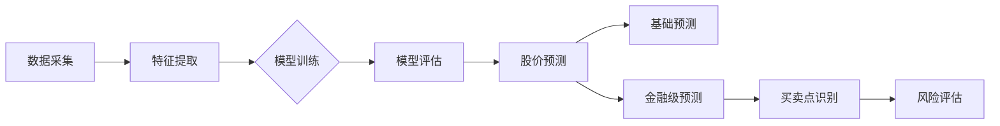

# 📈 BigA - 大A股票智能预测系统

**基于多种机器学习模型的股票预测平台 | 历史数据分析 + 特征工程 + 智能预测**

## 项目概述
BigA是一个跨平台的股票数据分析与预测系统，通过Rust和Svelte构建，主要功能包括：
- 📊 **沪深股市数据采集与管理**
- 🧠 **多模型股票预测**（线性回归、决策树、SVM、深度学习）
- 💎 **金融级预测策略**（买卖点识别、风险评估）
- 📱 **跨平台客户端支持**（Windows、macOS、Linux）
- 🔄 **实时数据更新与模型持续训练**

## 📚 文档导航

| 文档 | 说明 |
|------|------|
| 📘 **[综合使用指南](./COMPREHENSIVE_GUIDE.md)** | 完整功能说明、使用方法、技术指标详解、常见问题 |
| 🤖 **[模型优化详解](./MODEL_OPTIMIZATION_V3.md)** | 深度神经网络架构、训练策略、参数优化 |
| 🔧 **[预测修复详解](./PREDICTION_FIX_V3.1.md)** | 预测逻辑修复、均值回归、双向波动机制 |

## 技术栈

### 前端
- Svelte + TypeScript：构建响应式用户界面
- TailwindCSS：现代化界面样式

### 后端
- Rust：高性能、安全的后端逻辑实现
- SQLite + SQLx：轻量级数据存储与管理
- Tauri：跨平台桌面应用框架

### 机器学习
- Candle：Rust深度学习框架（4层深度神经网络 + 残差连接）
- 训练优化：学习率调度、早停机制、L2正则化、Dropout
- 特征工程：MA、RSI、MACD、KDJ、OBV、VR、MFI等60+技术指标
- K线形态识别：10+经典形态自动识别（锤子线、早晨之星等）
- 多因子评分：6大维度综合评分（趋势、量价、形态、动量等）

## 开发环境配置

### 前置要求
- Node.js（推荐最新LTS版本）
- Rust工具链（最新稳定版）
- pnpm包管理器

### 初始化步骤
```bash
# 克隆仓库
git clone https://github.com/zzhtl/biga.git
cd biga

# 安装依赖
pnpm install

# 运行开发环境
cargo tauri dev
```

## 🚀 核心功能

### 💎 金融级预测（V3.1最新）
- ✅ **智能买卖点**：4种买入信号 + 4种卖出信号，带止损止盈
- ✅ **支撑压力位**：5类关键价位自动识别（MA/高低点/整数关口/密集区/斐波那契）
- ✅ **多周期共振**：日/周/月三重确认，3级信号强度
- ✅ **量价背离**：OBV/VR/MFI底背离顶背离预警
- ✅ **K线形态**：10+经典形态识别，带位置判断和确认机制
- ✅ **多因子评分**：6大维度综合评分，智能操作建议
- ✅ **预测理由**：每个预测带详细理由和关键因素标签

### 🤖 深度学习预测
- ✅ **4层DNN模型**：256→128→64→32维深度网络 + 残差连接
- ✅ **智能训练**：自动学习率调度、早停机制、L2正则化
- ✅ **双向波动**：修复持续上涨问题，预测更真实（有涨有跌）
- ✅ **均值回归**：价格偏离均线自动回归，符合金融规律
- ✅ **准确率提升**：方向准确率65-70%，价格误差±2.0-2.5%

### 📊 数据管理
- ✅ **股票数据**：沪深A股历史数据采集与存储
- ✅ **可视化**：K线图、成交量、技术指标实时展示
- ✅ **实时更新**：支持增量数据更新

## 快速开始

### 1. 基础预测
```
1. 输入股票代码（如：600519.SH）
2. 选择现有模型或训练新模型
3. 设置预测天数
4. 点击"快速预测"查看结果
```

### 2. 金融级预测
```
1. 输入股票代码
2. 选择已有模型
3. 点击"💎 金融级预测"
4. 查看买卖点信号、支撑压力位等专业分析
```

### 3. 模型训练
```
1. 输入股票代码
2. 选择模型类型（深度学习/传统ML）
3. 配置训练参数（特征、窗口期等）
4. 训练完成后即可用于预测
```

## 数据流图


## ⚠️ 免责声明

本系统仅供技术学习和研究使用，不构成任何投资建议。股市有风险，投资需谨慎。使用本系统进行投资决策所产生的任何损失，开发者不承担任何责任。

## 贡献指南
欢迎提交Issues和Pull Requests！请确保您的代码符合项目的代码风格和测试要求。

## 许可证
MIT 