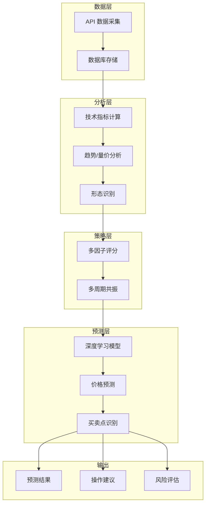

# 📈 BigA - 大A股票智能预测系统

**基于深度学习的股票预测平台 | 模块化架构 + 技术指标 + 多因子策略**

## 项目概述

BigA 是一个跨平台的股票数据分析与预测系统，采用 Rust + Svelte 构建，具有清晰的模块化架构：

- 📊 **沪深股市数据采集与管理**
- 🧠 **深度学习股票预测**（Candle 框架）
- 💎 **金融级预测策略**（多因子评分、买卖点识别）
- 📈 **技术指标分析**（MACD、KDJ、RSI、布林带等）
- 📱 **跨平台支持**（Windows、macOS、Linux）

## 🏗️ 项目架构

```
src-tauri/src/
├── lib.rs                 # 应用入口
├── error.rs               # 统一错误处理
│
├── config/                # 📋 配置模块
│   ├── constants.rs       # 常量定义
│   └── weights.rs         # 策略权重配置
│
├── utils/                 # 🔧 工具模块
│   ├── date.rs            # 日期处理
│   └── math.rs            # 数学计算
│
├── db/                    # 💾 数据层
│   ├── connection.rs      # 数据库连接池
│   ├── models.rs          # 数据模型
│   └── repository.rs      # 数据仓库（CRUD）
│
├── api/                   # 🌐 外部 API
│   └── stock.rs           # 股票数据接口
│
├── prediction/            # 🎯 预测核心模块
│   ├── types.rs           # 类型定义
│   │
│   ├── indicators/        # 📊 技术指标（MACD/KDJ/RSI/布林/OBV/CCI/DMI/ATR/量比换手等）
│   │
│   ├── analysis/          # 📈 分析模块（按职责拆分为文件夹模块）
│   │   ├── trend.rs / volume.rs / pattern.rs / support_resistance.rs
│   │   ├── divergence/          # 背离检测（detectors/checks/extremes/action）
│   │   ├── market_regime/       # 市场状态分类（indicators/volatility/classifier）
│   │   └── signal_confirmation/ # 信号确认（sources/conflict/weights/combination）
│   │
│   ├── strategy/          # 💡 策略模块
│   │   ├── multi_factor/        # 多因子评分（factors/weights/transform）
│   │   ├── professional_engine/ # 专业预测引擎（signals/direction/change/risk/output）
│   │   ├── adaptive_weights.rs / price_model.rs / multi_timeframe.rs
│   │
│   ├── model/             # 🤖 机器学习（Candle MLP）
│   │   ├── features.rs    # 特征工程（含量比/换手率）
│   │   ├── network.rs     # MLP + 训练（train_and_save/train_eval/train_predict）
│   │   ├── inference.rs   # 规则引擎编排 + analyze()  ／ ml_inference.rs
│   │   └── training.rs / management.rs
│   │
│   ├── backtest/          # 📉 真实走步回测（方向准确率/MAPE/朴素基准/edge/高置信）
│   ├── factor.rs          # 🧮 截面因子库（含 量比×换手率 组合因子）
│   └── cross_section.rs   # 🎯 滚动截面多因子排序（市场中性，有正样本外 IC）
│
├── services/              # ⚙️ 服务层
│   ├── stock.rs           # 股票服务
│   ├── historical.rs      # 历史数据服务
│   └── prediction.rs      # 预测服务
│
└── commands/              # 🎮 Tauri 命令
    ├── stock.rs           # 股票命令
    ├── stock_list.rs      # 股票列表
    ├── stock_realtime.rs  # 实时数据
    ├── stock_historical.rs # 历史数据
    └── stock_prediction.rs # 预测命令
```

## 技术栈

### 前端
- **Svelte + TypeScript**：响应式用户界面
- **原生 CSS 设计变量**：专业深色数据工作台

### 后端
- **Rust**：高性能后端逻辑
- **Tauri**：跨平台桌面应用框架
- **SQLite + SQLx**：异步数据库操作

### 机器学习
- **Candle**：Rust 原生深度学习框架
- **4层深度神经网络**：256→128→64→32 + 残差连接
- **训练优化**：AdamW、学习率调度、早停、L2 正则化、Dropout

## 🚀 核心功能

### 📊 技术指标（8大指标）
| 指标 | 说明 | 用途 |
|------|------|------|
| MACD | 指数平滑异同移动平均线 | 趋势判断、金叉死叉 |
| KDJ | 随机指标 | 超买超卖、短期转折 |
| RSI | 相对强弱指数 | 超买超卖判断 |
| 布林带 | Bollinger Bands | 波动区间、突破信号 |
| OBV | 能量潮指标 | 量价配合分析 |
| CCI | 商品通道指数 | 异常波动检测 |
| DMI | 趋向指标 | 趋势强度判断 |
| ATR | 真实波动幅度 | 波动率、止损设置 |

### 💎 金融级分析
- ✅ **趋势分析**：MA 多周期趋势、趋势强度量化
- ✅ **量价分析**：量价配合、OBV 趋势、吸筹信号
- ✅ **K线形态**：10+ 经典形态识别（锤子线、早晨之星等）
- ✅ **支撑阻力**：5类关键价位（MA/高低点/整数关口/密集区/斐波那契）
- ✅ **多因子评分**：7大维度综合评分
- ✅ **多周期共振**：日/周/月三重确认

### 🤖 深度学习预测
- ✅ **模型训练**：自定义训练参数、批量训练（Candle MLP，真实训练 + 保存）
- ✅ **智能预测**：价格预测 + 方向预测 + 置信度（有模型走 ML，否则规则引擎）
- ✅ **预测理由**：每个预测带详细理由和关键因素
- ✅ **模型管理**：保存、加载、删除、评估

### 🧮 量化因子研究（截面相对强弱，市场中性）
经严格走步回测（每期滚动重估因子权重，逐日累计样本外指标）得到的核心结论：

- **单股"次日涨跌方向"预测无超额**：规则引擎/单股 ML 方向准确率 ~46–48%，**低于"总猜多数方向"的朴素基准**（市场有效性使然）。
- **滚动截面多因子有真实 alpha**：前向 Rank IC ≈ **+0.05**，多空（top20%-bot20%）毛 +0.57%/5日，扣 0.3%/期双边成本后**净 ≈ +0.27%/5日**。
- **量比 × 换手率组合**显著强于单独使用（IC 强 3–4 倍）；主力因子为低振幅、低换手、低波动。
- **广度是最大杠杆**：扩大票池可持续提升 IC。

实现见 `prediction/factor.rs`（因子库）与 `prediction/cross_section.rs`（截面标准化 + 滚动 IC 加权 + 正交化 + 走步评估）；命令 `cross_sectional_ranking` 输出全市场相对强弱排名。

## 开发环境配置

### 前置要求
- Node.js（推荐 LTS 版本）
- Rust 工具链（最新稳定版）
- bun 包管理器

### 初始化步骤
```bash
# 克隆仓库
git clone https://github.com/zzhtl/biga.git
cd biga

# 安装依赖
bun install

# 运行开发环境
bun run tauri dev
```

### 运行示例 / 量化评测工具
```bash
cd src-tauri

# 单元 + 集成测试
cargo test

# —— 量化研究工具（务必 --release，否则训练/回测很慢）——
# 截面多因子评测：单因子 IC、前向滚动 Rank IC、正交化对比、加成本净多空、最新排名
cargo run --release --example cross_sectional

# 批量拉取更多股票历史+股本（改 examples/fetch_more_data.rs 的 CODES 列表）
cargo run --release --example fetch_more_data

# 全库回填股本/量比/换手率
cargo run --release --example batch_refresh

# 规则引擎走步回测 / 池化 ML 评测（对照，已证无超额）
cargo run --release --example tune_backtest
cargo run --release --example pooled_ml
```

## 快速开始

### 1. 基础预测
```
1. 输入股票代码（如：sh600519）
2. 选择现有模型或训练新模型
3. 设置预测天数
4. 点击"快速预测"查看结果
```

### 2. 金融级预测
```
1. 输入股票代码
2. 选择已有模型
3. 点击"💎 金融级预测"
4. 查看买卖点信号、支撑压力位等专业分析
```

### 3. 模型训练
```
1. 输入股票代码
2. 配置训练参数（epochs、batch_size、learning_rate）
3. 训练完成后即可用于预测
```

## 数据流图


```mermaid
graph TB
    subgraph 数据层
        A[API 数据采集] --> B[数据库存储]
    end
    
    subgraph 分析层
        B --> C[技术指标计算]
        C --> D[趋势/量价分析]
        D --> E[形态识别]
    end
    
    subgraph 策略层
        E --> F[多因子评分]
        F --> G[多周期共振]
    end
    
    subgraph 预测层
        G --> H[深度学习模型]
        H --> I[价格预测]
        I --> J[买卖点识别]
    end
    
    subgraph 输出
        J --> K[预测结果]
        J --> L[操作建议]
        J --> M[风险评估]
    end
```

## 📚 文档导航

| 文档 | 说明 |
|------|------|
| 📘 **[完整文档](./DOCS.md)** | 系统概述、技术指标、模型训练、权重配置、常见问题等 |

## ⚠️ 免责声明

本系统仅供技术学习和研究使用，不构成任何投资建议。股市有风险，投资需谨慎。使用本系统进行投资决策所产生的任何损失，开发者不承担任何责任。

## 贡献指南

欢迎提交 Issues 和 Pull Requests！请确保代码符合项目的代码风格和测试要求。

## 许可证

MIT
