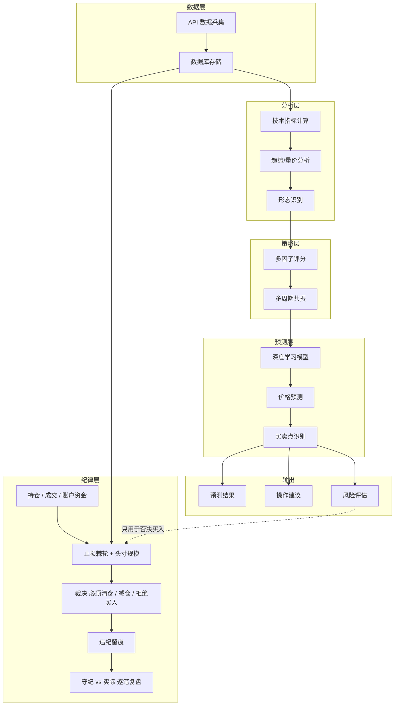

# 📈 BigA - 大A股票智能预测系统

**基于深度学习的股票预测平台 | 模块化架构 + 技术指标 + 多因子策略**

## 项目概述

BigA 是一个跨平台的股票数据分析与预测系统，采用 Rust + Svelte 构建，具有清晰的模块化架构：

- 📊 **沪深股市数据采集与管理**
- 🧠 **深度学习股票预测**（Candle 框架）
- 💎 **金融级预测策略**（多因子评分、买卖点识别）
- 📈 **技术指标分析**（MACD、KDJ、RSI、布林带等）
- 🛡️ **交易纪律引擎**（止损棘轮、头寸规模、违纪留痕、守纪复盘）
- 📱 **跨平台支持**（Windows、macOS、Linux）

## 📦 下载安装

从 **[Releases 页面](https://github.com/zzhtl/biga/releases/latest)** 下载对应平台的安装包：

| 平台 | 下载文件 | 说明 |
|------|---------|------|
| Windows 10/11 x64 | `BigA_*_x64-setup.exe` | 推荐；也提供 `BigA_*_x64_en-US.msi` |
| Linux x86_64 | `BigA_*_amd64.AppImage` | 免安装，`chmod +x` 后直接运行 |
| Linux（Debian/Ubuntu） | `BigA_*_amd64.deb` | `sudo dpkg -i BigA_*_amd64.deb` |
| macOS Apple Silicon | `BigA_*_aarch64.dmg` | **仅 M 系列芯片**，不提供 Intel 版 |

> Linux 包在 Ubuntu 22.04（glibc 2.35）上构建，更老的发行版请自行编译。

### 首次启动

本项目没有购买代码签名证书，系统会拦截，属正常现象：

- **Windows**：SmartScreen 弹「已保护你的电脑」→ 点「更多信息」→「仍要运行」
- **macOS**：提示「已损坏，无法打开」是 Gatekeeper 的隔离属性所致，执行一次
  `xattr -cr /Applications/BigA.app` 后即可正常打开
- **Linux**：无此问题

行情数据来自 zhituapi（接口域名 `api.zhituapi.com`），需自备 API 密钥，在应用的 **系统设置**
页填写后才能取数。密钥交由**系统钥匙串**保管（服务名 `com.biga.app`），不写进项目目录、
不进日志，界面上只显示末 4 位；也可用环境变量 `STOCK_API_TOKEN` 覆盖。

数据库首次启动自动创建，**卸载不会删除**——持仓与成交记录都在里面：

| 平台 | 路径 |
|------|------|
| Windows | `%APPDATA%\com.biga.app\stock_data.db` |
| Linux | `~/.local/share/com.biga.app/stock_data.db` |
| macOS | `~/Library/Application Support/com.biga.app/stock_data.db` |

> 从源码以 `bun run tauri dev` 运行时，库仍放在 `src-tauri/db/stock_data.db`，
> 开发和安装版互不干扰。

## 🏗️ 项目架构

```
src-tauri/src/
├── lib.rs                 # 应用入口
├── error.rs               # 统一错误处理
│
├── config/                # 📋 配置模块
│   ├── constants.rs       # 常量定义
│   └── weights.rs         # 策略权重配置
│
├── utils/                 # 🔧 工具模块
│   ├── date.rs            # 日期处理
│   └── math.rs            # 数学计算
│
├── db/                    # 💾 数据层
│   ├── connection.rs      # 数据库连接池
│   ├── models.rs          # 数据模型
│   └── repository.rs      # 数据仓库（CRUD）
│
├── api/                   # 🌐 外部 API
│   └── stock.rs           # 股票数据接口
│
├── prediction/            # 🎯 预测核心模块
│   ├── types.rs           # 类型定义
│   │
│   ├── indicators/        # 📊 技术指标（MACD/KDJ/RSI/布林/OBV/CCI/DMI/ATR/量比换手等）
│   │
│   ├── analysis/          # 📈 分析模块（按职责拆分为文件夹模块）
│   │   ├── trend.rs / volume.rs / pattern.rs / support_resistance.rs
│   │   ├── divergence/          # 背离检测（detectors/checks/extremes/action）
│   │   ├── market_regime/       # 市场状态分类（indicators/volatility/classifier）
│   │   └── signal_confirmation/ # 信号确认（sources/conflict/weights/combination）
│   │
│   ├── strategy/          # 💡 策略模块
│   │   ├── multi_factor/        # 多因子评分（factors/weights/transform）
│   │   ├── professional_engine/ # 专业预测引擎（signals/direction/change/risk/output）
│   │   ├── adaptive_weights.rs / price_model.rs / multi_timeframe.rs
│   │
│   ├── model/             # 🤖 机器学习（Candle MLP）
│   │   ├── features.rs    # 特征工程（含量比/换手率）
│   │   ├── network.rs     # MLP + 训练（train_and_save/train_eval/train_predict）
│   │   ├── inference.rs   # 规则引擎编排 + analyze()  ／ ml_inference.rs
│   │   └── training.rs / management.rs
│   │
│   ├── backtest/          # 📉 真实走步回测（方向准确率/MAPE/朴素基准/edge/高置信）
│   ├── factor.rs          # 🧮 截面因子库（含 量比×换手率 组合因子）
│   └── cross_section.rs   # 🎯 滚动截面多因子排序（市场中性，有正样本外 IC）
│
├── discipline/            # 🛡️ 交易纪律引擎（执行约束层，全部为无 IO 纯函数）
│   ├── rules.rs           # 阈值配置 + 默认值的数学含义
│   ├── stop.rs            # 止损线：四候选取最严 + 棘轮只上移
│   ├── sizing.rs          # 头寸规模：单笔风险反推股数 + A股手数取整（科创板 200 股起）
│   ├── facts.rs           # 从日线提取客观事实（ATR/支撑位/持仓最高价/除权检测）
│   ├── exit.rs            # 卖出纪律（硬止损/移动止盈/分批止盈/时间止损/放量破位）
│   ├── entry.rs           # 买入准入清单（只否决，不推荐）
│   └── replay.rs          # 严格守纪回放（复盘的反事实对照）
│
├── services/              # ⚙️ 服务层
│   ├── stock.rs           # 股票服务
│   ├── historical.rs      # 历史数据服务
│   └── prediction.rs      # 预测服务
│
└── commands/              # 🎮 Tauri 命令
    ├── stock.rs           # 股票命令
    ├── stock_list.rs      # 股票列表
    ├── stock_realtime.rs  # 实时数据
    ├── stock_historical.rs # 历史数据
    ├── stock_prediction.rs # 预测命令
    ├── watchlist.rs       # 收藏池
    └── discipline.rs      # 交易纪律（账户/持仓/成交/裁决/复盘）
```

## 技术栈

### 前端
- **Svelte + TypeScript**：响应式用户界面
- **原生 CSS 设计变量**：专业深色数据工作台

### 后端
- **Rust**：高性能后端逻辑
- **Tauri**：跨平台桌面应用框架
- **SQLite + SQLx**：异步数据库操作

### 机器学习
- **Candle**：Rust 原生深度学习框架
- **4层深度神经网络**：256→128→64→32 + 残差连接
- **训练优化**：AdamW、学习率调度、早停、L2 正则化、Dropout

## 🚀 核心功能

### 📊 技术指标（8大指标）
| 指标 | 说明 | 用途 |
|------|------|------|
| MACD | 指数平滑异同移动平均线 | 趋势判断、金叉死叉 |
| KDJ | 随机指标 | 超买超卖、短期转折 |
| RSI | 相对强弱指数 | 超买超卖判断 |
| 布林带 | Bollinger Bands | 波动区间、突破信号 |
| OBV | 能量潮指标 | 量价配合分析 |
| CCI | 商品通道指数 | 异常波动检测 |
| DMI | 趋向指标 | 趋势强度判断 |
| ATR | 真实波动幅度 | 波动率、止损设置 |

### 💎 金融级分析
- ✅ **趋势分析**：MA 多周期趋势、趋势强度量化
- ✅ **量价分析**：量价配合、OBV 趋势、吸筹信号
- ✅ **K线形态**：10+ 经典形态识别（锤子线、早晨之星等）
- ✅ **支撑阻力**：5类关键价位（MA/高低点/整数关口/密集区/斐波那契）
- ✅ **多因子评分**：7大维度综合评分
- ✅ **多周期共振**：日/周/月三重确认

### 🤖 深度学习预测
- ✅ **模型训练**：自定义训练参数、批量训练（Candle MLP，真实训练 + 保存）
- ✅ **智能预测**：价格预测 + 方向预测 + 置信度（有模型走 ML，否则规则引擎）
- ✅ **预测理由**：每个预测带详细理由和关键因素
- ✅ **模型管理**：保存、加载、删除、评估

### 🛡️ 交易纪律（执行约束层）

分析给结论，纪律管执行。这一层**不预测方向**——输入全是客观事实（成本价、收盘价、
持仓期最高价、ATR、支撑位、持有交易日数、账户资金），只回答两件事：
什么条件下不该继续持有，以及这笔买入是否符合资金管理。

| 机制 | 做法 |
|------|------|
| **单笔风险恒定** | 最大亏损锁死在总资产 2%，由此反推可买股数。止损放宽则股数同比例减少、敞口不变——堵掉「放宽止损多买一点」这条路 |
| **止损棘轮** | 固定 8% / 3.5×ATR / 支撑位下方，三者取最严；此后**只上移不下移**。补跌摊薄成本不能成为放宽止损的借口 |
| **先想好怎么输** | 买入前必须填止损价与目标价，盈亏比 < 2:1 直接拒绝；按风险预算买不到一手时诚实拒绝，不给整手凑合 |
| **违纪留痕** | 不执行必须填 ≥10 字理由（后端校验，前端 `if` 不算数）；标记「已执行」必须先有关联成交 |
| **复盘对账** | 逐笔对比「严格守纪」与「实际」的盈亏差额，并与当时填的那句理由并排展示 |

其余规则：移动止盈（盈 10% 后回撤 8%）、分批止盈（+15% / +30% 各减半）、
时间止损（20 个交易日未达 +3%）、放量破位、单票 25% / 总仓 80% / 持股 5 只上限、
止损后 10 个交易日冷静期、连亏 3 笔熔断停手 5 个交易日。阈值均可在界面调整。

**几处刻意的口径**（改动前请先读对应模块的文档注释）：

- 触发判定一律用**收盘价**，不用盘中价——盘中插针会制造大量无法复现的假信号；
  但持仓最高价取**日线 high**，用收盘价记峰值会系统性低估回撤、让移动止盈晚触发。
- 行情源为不复权日线，检测到除权除息（比对接口 `pre_close` 与上一根收盘）会
  **挂起全部卖出规则**并提示手工修正成本价——宁可不判，也不能拿错基准逼人割肉。
- 复盘成交价取**触发次日开盘价**而非止损价，跳空如实计入；一字跌停与停牌顺延，
  顺延超限的笔从统计中剔除并单独计数。它只回答「纪律会不会让你更早离场」，
  不合成组合净值曲线——那需要假设止损释放的资金去了哪里。

### 🧮 量化因子研究（截面相对强弱，市场中性）
经严格走步回测（每期滚动重估因子权重，逐日累计样本外指标）得到的核心结论：

- **单股"次日涨跌方向"预测无超额**：规则引擎/单股 ML 方向准确率 ~46–48%，**低于"总猜多数方向"的朴素基准**（市场有效性使然）。
- **滚动截面多因子有真实 alpha**：前向 Rank IC ≈ **+0.05**，多空（top20%-bot20%）毛 +0.57%/5日，扣 0.3%/期双边成本后**净 ≈ +0.27%/5日**。
- **量比 × 换手率组合**显著强于单独使用（IC 强 3–4 倍）；主力因子为低振幅、低换手、低波动。
- **广度是最大杠杆**：扩大票池可持续提升 IC。

实现见 `prediction/factor.rs`（因子库）与 `prediction/cross_section.rs`（截面标准化 + 滚动 IC 加权 + 正交化 + 走步评估）；命令 `cross_sectional_ranking` 输出全市场相对强弱排名。

## 开发环境配置

### 前置要求
- Node.js（推荐 LTS 版本）
- Rust 工具链（最新稳定版）
- bun 包管理器

### 初始化步骤
```bash
# 克隆仓库
git clone https://github.com/zzhtl/biga.git
cd biga

# 安装依赖
bun install

# 运行开发环境
bun run tauri dev
```

### 运行示例 / 量化评测工具
```bash
cd src-tauri

# 单元 + 集成测试
cargo test

# —— 量化研究工具（务必 --release，否则训练/回测很慢）——
# 截面多因子评测：单因子 IC、前向滚动 Rank IC、正交化对比、加成本净多空、最新排名
cargo run --release --example cross_sectional

# 批量拉取更多股票历史+股本（改 examples/fetch_more_data.rs 的 CODES 列表）
cargo run --release --example fetch_more_data

# 全库回填股本/量比/换手率
cargo run --release --example batch_refresh

# 规则引擎走步回测 / 池化 ML 评测（对照，已证无超额）
cargo run --release --example tune_backtest
cargo run --release --example pooled_ml
```

### 本地打包
```bash
# 产物落在 src-tauri/target/release/bundle/
bun run tauri build --bundles deb,appimage                        # Linux
bun run tauri build --bundles nsis,msi                            # Windows
bun run tauri build --target aarch64-apple-darwin --bundles dmg   # macOS（M 芯片）
```

> 注意**没有** `--` 分隔符。bun 会把参数直接透传给脚本，多写一个 `--` 会让 tauri CLI
> 把后面的东西当成 cargo 参数，报 `unexpected argument '--bundles'`。

### 发布 Release

`.github/workflows/release.yml` 在推送 `v*` 标签时为三个平台出包，产物挂到**草稿** Release：

1. 把 `src-tauri/tauri.conf.json` 的 `version` 改成目标版本
   （workflow 会校验标签与它一致，对不上直接失败，避免「标签 v0.3.0 里躺着 0.1.0 的包」）
2. `git tag v0.1.1 && git push origin v0.1.1`
3. 三个平台跑完后到 Releases 页面检查草稿，**自己装一遍**再点 Publish

也可在 Actions 页面手动触发（需填标签名），用于验证流程而不正式发版。
包未做代码签名，Windows 会弹 SmartScreen、macOS 需 `xattr -cr`，已写进 Release 说明。

## 快速开始

### 1. 基础预测
```
1. 输入股票代码（如：sh600519）
2. 选择现有模型或训练新模型
3. 设置预测天数
4. 点击"快速预测"查看结果
```

### 2. 金融级预测
```
1. 输入股票代码
2. 选择已有模型
3. 点击"💎 金融级预测"
4. 查看买卖点信号、支撑压力位等专业分析
```

### 3. 模型训练
```
1. 输入股票代码
2. 配置训练参数（epochs、batch_size、learning_rate）
3. 训练完成后即可用于预测
```

### 4. 交易纪律
```
1. 侧栏进入「交易纪律」，在账户区填写可用现金（总资产 = 现金 + 持仓市值，自动现算）
2.「买入检查」填代码 / 买入价 / 止损价 / 目标价
   → 实时给出最大可买股数、盈亏比，以及被拦下的每一条规则和理由
3. 合规后建仓，成交流水会自动增减现金
4. 每次打开应用自动扫描持仓；触发必卖时全局置顶红色横幅（切到任何页面都在）
5. 处理横幅：录入卖出成交（已执行），或填写 ≥10 字理由（违纪留痕）
6.「纪律复盘」查看守纪率，以及「严格守纪 vs 实际」的逐笔盈亏差额
```

## 数据流图


```mermaid
graph TB
    subgraph 数据层
        A[API 数据采集] --> B[数据库存储]
    end
    
    subgraph 分析层
        B --> C[技术指标计算]
        C --> D[趋势/量价分析]
        D --> E[形态识别]
    end
    
    subgraph 策略层
        E --> F[多因子评分]
        F --> G[多周期共振]
    end
    
    subgraph 预测层
        G --> H[深度学习模型]
        H --> I[价格预测]
        I --> J[买卖点识别]
    end
    
    subgraph 输出
        J --> K[预测结果]
        J --> L[操作建议]
        J --> M[风险评估]
    end

    subgraph 纪律层
        N[持仓 / 成交 / 账户资金] --> O[止损棘轮 + 头寸规模]
        B --> O
        O --> P[裁决 必须清仓 / 减仓 / 拒绝买入]
        P --> Q[违纪留痕]
        Q --> R[守纪 vs 实际 逐笔复盘]
    end

    M -.->|只用于否决买入| O
```

> 纪律层对预测层是**单向依赖**：它读风险等级用于否决买入，但裁决结果绝不回灌进预测。
> `prediction/` 里不出现 `use crate::discipline`，这条约束可以用 grep 直接验。

## 📚 文档导航

| 文档 | 说明 |
|------|------|
| 📘 **[完整文档](./DOCS.md)** | 系统概述、技术指标、模型训练、权重配置、常见问题等 |

## ⚠️ 免责声明

本系统仅供技术学习和研究使用，不构成任何投资建议。股市有风险，投资需谨慎。使用本系统进行投资决策所产生的任何损失，开发者不承担任何责任。

关于交易纪律引擎，还有两点需要说清楚：

- 它**不预测方向**，也不判断某只票值不值得买。买入检查显示「未发现纪律冲突」，
  只表示这笔交易没有违反你自己设定的资金管理规则，与后市涨跌无关。
- 复盘页的「严格守纪盈亏」是同一笔建仓下的**反事实估算**，不是回测收益，更不是
  对未来的承诺；它只回答「纪律会不会让你更早离场、离场价差多少」。

本项目自己的量化结论是：**单股次日方向不可预测**——规则引擎与单股 ML 的方向准确率
均低于「总猜多数方向」的朴素基准（见上文量化因子研究）。请据此理解本系统所有输出的性质：
预测部分是概率性的描述，纪律部分是确定性的约束，两者性质完全不同。

## 贡献指南

欢迎提交 Issues 和 Pull Requests！请确保代码符合项目的代码风格和测试要求。

## 许可证

MIT
